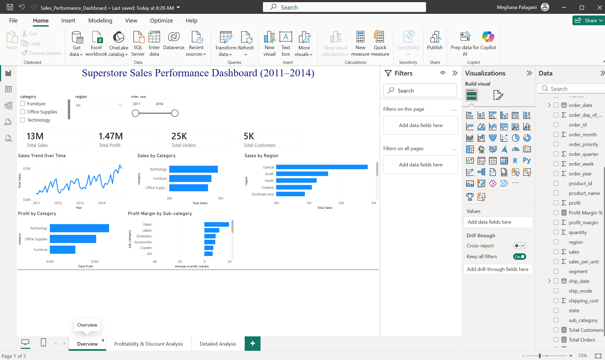
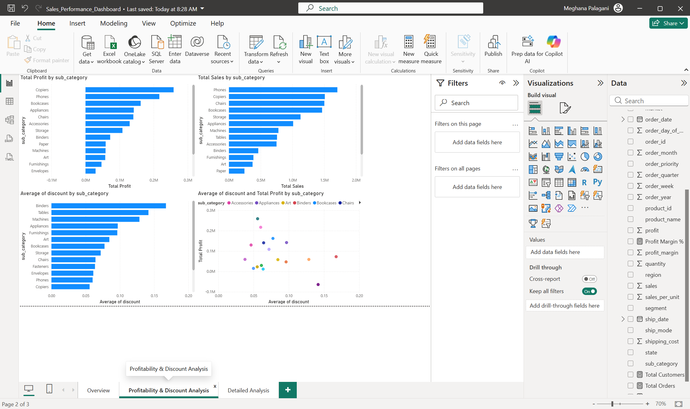

# Superstore Sales Performance Dashboard

## Project Overview

This project analyzes sales, profit, customer activity, and profitability trends using Power BI. The dashboard helps business stakeholders understand overall performance, identify high-performing categories and regions, and evaluate the impact of discounts on profitability.

## Tools Used

* Power BI
* Power Query
* DAX
* Microsoft Excel / CSV Dataset

---

## Business Objectives

The dashboard was built to answer the following business questions:

1. How much did we sell?
2. How much profit did we make?
3. How many orders were placed?
4. How many customers purchased?
5. How are sales changing over time?
6. Which categories generate the most sales?
7. Which regions generate the most sales?
8. Are discounts affecting profitability?

---

## Dashboard Pages

### 1. Overview Dashboard

Provides a high-level view of business performance.

Key Metrics:

* Total Sales
* Total Profit
* Total Orders
* Total Customers

Visuals:

* Sales Trend Over Time
* Sales by Category
* Sales by Region
* Profit by Category
* Profit Margin by Sub-Category

---

### 2. Profitability & Discount Analysis

Focuses on understanding the relationship between discounts and profitability.

Visuals:

* Profit by Sub-Category
* Sales by Sub-Category
* Average Discount by Sub-Category
* Discount vs Profit Scatter Plot

Insights:

* Identifies highly profitable products.
* Highlights products with high discount levels.
* Helps evaluate whether discounts negatively impact profits.

---

### 3. Detailed Analysis

Provides detailed drill-down analysis.

Features:

* Sales Distribution by Category
* Interactive Filters
* Detailed Performance Table

Fields Included:

* Category
* Sub-Category
* Region
* Sales
* Profit
* Profit Margin %

---

## Key Insights

* Technology generated the highest sales and profit.
* Some sub-categories generated high sales but lower profitability.
* Discount levels showed a measurable impact on profit margins.
* Certain regions consistently outperformed others in sales generation.
* Profitability varies significantly across product sub-categories.

---

## Skills Demonstrated

* Data Cleaning and Transformation
* Data Modeling
* DAX Measures
* KPI Development
* Interactive Dashboard Design
* Business Performance Analysis
* Profitability Analysis
* Data Storytelling

---

## Author

Meghana Palagani

Master's in Computer Science
Aspiring Data Analyst | Business Intelligence Analyst
